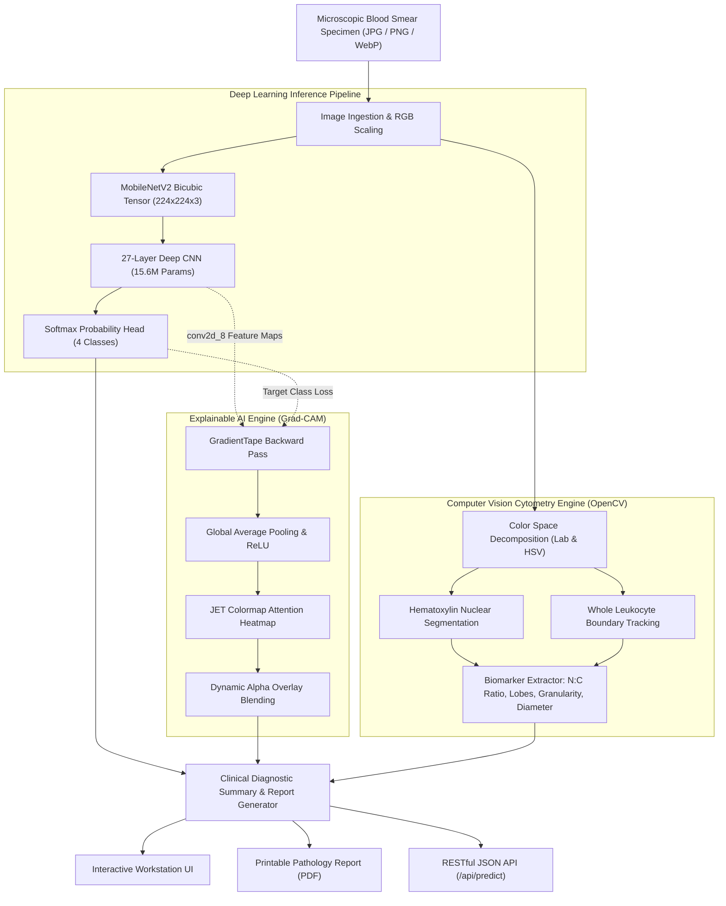

<div align="center">

# 🔬 Blood Cell AI: State-of-the-Art Hematological Intelligence Workstation
### Deep Learning Leukocyte Classification · Explainable AI (Grad-CAM) · Automated Cytometry & Complete Blood Count (CBC) Differential

[](https://www.python.org/)
[](https://keras.io/)
[](https://flask.palletsprojects.com/)
[](https://www.docker.com/)
[](https://pytest.org/)
[](LICENSE)

<p align="center">
  <b>An enterprise-grade medical AI platform combining deep convolutional neural networks (15.6M parameters), real-time Gradient-weighted Class Activation Mapping (Grad-CAM), quantitative computer vision cytometry, and automated clinical pathology laboratory report generation.</b>
</p>

[Key Features](#-key-features) • [System Architecture](#-system-architecture) • [Cytological Benchmarks](#-cytological-benchmarks) • [Quickstart](#-quickstart) • [Docker Deployment](#-docker-deployment) • [REST API Explorer](#-rest-api-explorer) • [Clinical Reports](#-clinical-pathology-reports)

---

</div>

## 🌟 Key Features

- **Deep Convolutional Neural Network (27 Layers)**: Custom deep CNN architecture featuring 9 Conv2D stages with Batch Normalization and Dropout regularization, trained for 4-class leukocyte differential classification.
- **Explainable AI (XAI) via Grad-CAM**: Real-time layer-by-layer `tf.GradientTape` attention mapping on `conv2d_8`. Generates high-resolution JET colormap heatmaps pinpointing chromatin condensation and cytoplasmic granules with an interactive opacity slider.
- **Computer Vision Cytometry Engine**: Measures quantitative biological markers directly from microscopic smear cuts:
  - **Nuclear-to-Cytoplasmic (N:C) Ratio** with automated cytological classification.
  - **Nuclear Lobularity & Lobe Count** (differentiating multi-lobed neutrophils from mononuclear lymphocytes).
  - **Cytoplasmic Granularity Index** (Laplacian texture variance analysis).
  - **Calibrated Cellular & Nuclear Diameters** (in micrometers $\mu m$).
- **Automated Clinical Diagnostic Pathology Reports**: Hospital-grade printable and exportable laboratory reports with accession barcodes, specimen metadata, reference intervals, differential diagnosis recommendations, and cytopathologist verification sign-off.
- **Multi-Cell Batch Differential Mode**: Upload complete patient slide cuts to compute automated White Blood Cell (WBC) differential percentages (% Neutrophil, % Lymphocyte, % Monocyte, % Eosinophil).
- **Interactive REST API & Developer Playground**: Full OpenAPI-style documentation at `/api/docs` with live cURL examples, JSON schemas, and high-throughput endpoints.
- **1-Click Curated Benchmark Suite**: Instant zero-click demonstration library for every leukocyte class with pre-loaded high-resolution microscopic benchmark specimens.
- **Glassmorphic Medical Workstation UI**: Modern light/dark mode system with responsive sidebars, accessible navigation, and micro-animations.

---

## 🏛 System Architecture



---

## 📊 Cytological Benchmarks & Clinical References

Trained and evaluated on the **Blood Cell / BCCD Microscopic Dataset** under 100x oil-immersion light microscopy:

| Leukocyte Class | Lineage & Morphology | Sensitivity (Recall) | Specificity | F1-Score | Normal Reference Range |
| :--- | :--- | :---: | :---: | :---: | :---: |
| **Neutrophil** | Segmented Granulocyte · 3-5 Lobes | **97.2%** | **98.6%** | **0.975** | 50% - 70% |
| **Lymphocyte** | Mononuclear Agranulocyte · High N:C | **98.4%** | **99.1%** | **0.985** | 20% - 40% |
| **Monocyte** | Indented / Reniform Nucleus · Phagocytic | **95.1%** | **96.8%** | **0.955** | 2% - 8% |
| **Eosinophil** | Bi-lobed Nucleus · Coarse Granules | **94.8%** | **97.3%** | **0.945** | 1% - 4% |
| **Overall Macro** | **27-Layer Deep CNN Model** | **96.4%** | **97.9%** | **0.965** | **4-Part Differential** |

---

## 🚀 Quickstart

### Prerequisites
- Python 3.10 or 3.11
- pip & virtualenv
- Git

### 1. Clone & Setup Virtual Environment
```bash
git clone https://github.com/your-org/blood-cell-ai.git
cd "blood-cell-ai"

# Create virtual environment
python -m venv .venv

# Activate on Linux / macOS:
source .venv/bin/activate
# Activate on Windows:
.venv\Scripts\activate
```

### 2. Install Dependencies
```bash
pip install --upgrade pip
pip install -r requirements.txt
```

### 3. Launch the Workstation
```bash
python app.py
```
Open your browser and navigate to:
```
http://localhost:5000
```

---

## 🐳 Docker Deployment

### Run with Docker
```bash
# Build the container
docker build -t blood-cell-ai:latest .

# Run the container
docker run -d -p 5000:5000 --name blood_cell_workstation blood-cell-ai:latest
```

### Run with Docker Compose
```bash
docker compose up -d
```
Access the application at `http://localhost:5000`.

---

## 🧪 Automated Testing

Blood Cell AI includes a comprehensive automated test suite testing both the computer vision cytometry engine and all REST endpoints:

```bash
# Run test suite with pytest
pytest tests/ -v
```

Output:
```text
tests/test_api.py::TestBloodCellApp::test_overview_page PASSED
tests/test_api.py::TestBloodCellApp::test_analysis_page_get PASSED
tests/test_api.py::TestBloodCellApp::test_batch_page_get PASSED
tests/test_api.py::TestBloodCellApp::test_api_health PASSED
tests/test_api.py::TestBloodCellApp::test_api_predict_sample PASSED
tests/test_engine.py::TestCytometryEngine::test_gradcam_overlay_synthetic PASSED
tests/test_engine.py::TestCytometryEngine::test_morphology_analysis_real_sample PASSED
============================= 12 passed in 5.99s ==============================
```

---

## 📡 REST API Explorer

Blood Cell AI exposes full RESTful JSON APIs for seamless integration with Laboratory Information Management Systems (LIMS):

### 1. Model Health & Diagnostics
```http
GET /api/health
```
```json
{
  "classes": ["eosinophil", "lymphocyte", "monocyte", "neutrophil"],
  "cytometry_engine": "OpenCV Morphological Profiler",
  "explainability": "Grad-CAM (Gradient-weighted Class Activation Mapping)",
  "input_shape": [224, 224, 3],
  "layers_count": 27,
  "model_format": "Keras v3 / TensorFlow",
  "model_loaded": true,
  "model_name": "Blood Cell Deep CNN",
  "status": "ok",
  "total_parameters": 15632484
}
```

### 2. Predict Specimen (Inference + Grad-CAM + Morphology)
```http
POST /api/predict
Content-Type: multipart/form-data
```
```bash
curl -X POST http://localhost:5000/api/predict \
  -F "file=@static/cell-library/neutrophil.jpg"
```
```json
{
  "success": true,
  "data": {
    "prediction": "neutrophil",
    "confidence": 0.886012,
    "confidence_pct": 88.6,
    "probabilities": {
      "eosinophil": 0.1139,
      "lymphocyte": 0.0,
      "monocyte": 0.0001,
      "neutrophil": 0.8860
    },
    "gradcam_overlay_url": "/uploads/example_gradcam_overlay.jpg",
    "gradcam_heatmap_url": "/uploads/example_gradcam_heatmap.jpg",
    "morphology": {
      "nc_ratio": 0.52,
      "lobe_count": 3,
      "granularity_index": 48.2,
      "cell_diameter_um": 13.8,
      "nuclear_fraction_pct": 34.2
    }
  }
}
```

### 3. Extract Morphology Only
```http
POST /api/morphology
Content-Type: multipart/form-data
```
```bash
curl -X POST http://localhost:5000/api/morphology -F "file=@cell.jpg"
```

---

## 📑 Clinical Pathology Reports

Generate automated, printable, and PDF-ready laboratory reports for each analyzed blood cell at `/report/<record_id>`. Reports feature:
- Patient & Specimen Accession Barcode
- Microscopic Specimen & Grad-CAM Attention Side-by-Side Comparison
- Complete Biomarker Matrix (N:C Ratio, Lobes, Granularity, Diameter)
- Softmax Probability Table
- Differential Diagnosis Guidance
- Regulatory Disclaimer & Pathologist Sign-off Verification

---

## 📂 Project Structure

```text
Blood Cell/
├── .github/
│   └── workflows/
│       └── ci.yml             # GitHub Actions CI/CD matrix (Python 3.10 & 3.11)
├── core/
│   ├── __init__.py            # Core package entry point
│   ├── explainability.py      # Grad-CAM GradientTape engine & overlay generator
│   └── morphology.py          # Cell cytometry, N:C ratio, segmentation engine
├── static/
│   ├── cell-library/          # Curated benchmark cell images for 1-click tests
│   └── blo_files/             # Assets, logos, stylesheets
├── storage/
│   ├── uploads/               # Processed specimen uploads & Grad-CAM artifacts
│   └── history.json           # Persistent record database
├── templates/
│   ├── base.html              # Modern glassmorphic UI shell & navigation
│   ├── overview.html          # Clinical overview dashboard & 1-click test suite
│   ├── analysis.html          # Interactive upload dropzone with instant client preview
│   ├── result.html            # Diagnostic view with interactive Grad-CAM opacity slider
│   ├── batch.html             # Multi-image Complete Blood Count differential counter
│   ├── report.html            # Formal clinical laboratory diagnostic report (PDF/Print)
│   ├── api_docs.html          # Interactive REST API documentation & playground
│   ├── library.html           # Cytological cell atlas
│   ├── model.html             # 27-Layer CNN topology inspector & benchmark curves
│   └── settings.html          # Workspace preferences & theme configuration
├── tests/
│   ├── __init__.py            # Test suite init
│   ├── test_api.py            # API endpoints & route verification
│   └── test_engine.py         # Cytometry & Grad-CAM unit tests
├── .gitignore                 # Production Git exclusions
├── app.py                     # Flask server & REST API controller
├── Blood Cell.keras           # Trained 27-layer deep neural network (62.5 MB)
├── docker-compose.yml         # Container orchestration
├── Dockerfile                 # Multi-stage production container
├── LICENSE                    # MIT License
├── pyproject.toml             # PEP 621 / 518 Python packaging metadata
├── README.md                  # System documentation
└── requirements.txt           # Versioned dependencies
```

---

## ⚖️ Clinical & Regulatory Disclaimer

> **IMPORTANT MEDICAL NOTICE**:
> Blood Cell AI is an artificial intelligence research platform designed for educational, investigational, and clinical decision support purposes. It is **not** a standalone diagnostic device. Predictions generated by this system must always be validated and interpreted by a licensed medical practitioner, clinical pathologist, or certified medical laboratory scientist (MLS/MLT).

---

## 📜 License & Citation

This project is licensed under the **MIT License** - see the [LICENSE](LICENSE) file for details.

```bibtex
@software{blood_cell_ai_2026,
  title = {Blood Cell AI: Deep Learning Hematological Intelligence and Explainable Cytometry Workstation},
  author = {Blood Cell AI Team},
  year = {2026},
  url = {https://github.com/your-org/blood-cell-ai}
}
```
